<!--
title: '🏆 TROPHIES'
description: 'Trophies and achievements a GitHub profile or repository earns for itself: measured on a schedule, drawn as committed SVGs, never fetched.'
tags: [trophies, achievements, svg, github-actions, profile-readme]
category: docs
-->

<!-- markdownlint-disable MD041 -->

<div align="center">

# 🏆 TROPHIES

<a name="top"></a>

**Trophies a GitHub profile or repository earns for itself.**

_Earned, never claimed._

</div>

---

## 💡 What This Is

A scheduled action measures a GitHub profile, or a single repository, and
draws the result as **committed SVGs**: eight tiered trophies, Bronze to
Diamond, a level card, and one hundred achievements in a dropdown. Nothing is
fetched when someone views the README, so nothing can be slow, rate-limited or
down.

**Up 24/7/365.** Most trophy services are a web server that draws your card
on every page view, and when that server is rate-limited, cold, or gone, your
README shows a broken image. Here there is no server. The images are files in
your repository, served by GitHub itself, so your case is up for exactly as
long as GitHub is. The only thing that runs on a schedule is the refresh, and
a refresh that is delayed or skipped changes nothing you can see: yesterday's
trophies stay on the page until the next one lands.

Every trophy and achievement is explained in the
[**catalogue**](docs/Catalogue.md): what it counts, how it is earned, and how
rare it is. Every card in a rendered case links to its own entry, so the
question "what is that one for?" is one click away.

It is built the way [`tannergolden/emblems`](https://github.com/tannergolden/emblems)
builds badges and the way [`tannergolden/standards`](https://github.com/tannergolden/standards)
delivers automation: **called, never copied**. Your repository holds a stub
that names the schedule. The measuring, drawing and committing happen here,
so a fix lands once and reaches every case pinned to `v1`.

| Part                     | Job                                                                       |
| :----------------------- | :------------------------------------------------------------------------ |
| `src/trophy-kit.py`      | **The kit.** Measures over GitHub's API and renders the SVGs. Stdlib only. |
| `action.yml`             | **The action.** Runs the kit against the calling repository.              |
| `.github/workflows/trophies.yml` | **The workflow.** Checkout, kit, commit as the bot. What your stub calls. |
| `src/trophykit/catalogue.py` | **The catalogue.** Every trophy and achievement, as data.               |

---

## 🖼️ What It Looks Like

There is one live example of each mode.

- **Profile mode** is on [**@tannergolden's profile**](https://github.com/tannergolden):
  the case a person earns across every repository they own, with the
  profile's own hundred achievements. It is refreshed daily by the same stub
  shown [below](#-use-it-on-your-profile).
- **Repository mode** is this repository's own case, right here. It is
  refreshed every day by [`🏆 Case`](.github/workflows/case.yml), which calls
  the same workflow you would.

<!-- trophies:start -->

<p align="center">
  <picture><source media="(prefers-color-scheme: dark)" srcset="assets/trophies/level.svg">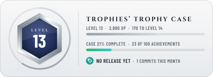</picture>
  <picture><source media="(prefers-color-scheme: dark)" srcset="assets/trophies/next-up.svg">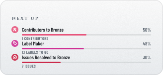</picture>
</p>

<p align="center">
  <a href="https://github.com/tannergolden/trophies/blob/HEAD/docs/Catalogue.md#repository-stars"><picture><source media="(prefers-color-scheme: dark)" srcset="assets/trophies/stars.svg"></picture></a>
  <a href="https://github.com/tannergolden/trophies/blob/HEAD/docs/Catalogue.md#repository-forks"><picture><source media="(prefers-color-scheme: dark)" srcset="assets/trophies/forks.svg">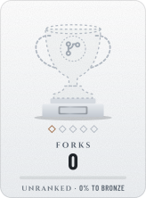</picture></a>
  <a href="https://github.com/tannergolden/trophies/blob/HEAD/docs/Catalogue.md#repository-contributors"><picture><source media="(prefers-color-scheme: dark)" srcset="assets/trophies/contributors.svg"></picture></a>
  <a href="https://github.com/tannergolden/trophies/blob/HEAD/docs/Catalogue.md#repository-commits"><picture><source media="(prefers-color-scheme: dark)" srcset="assets/trophies/commits.svg">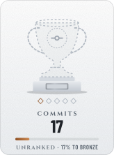</picture></a>
  <a href="https://github.com/tannergolden/trophies/blob/HEAD/docs/Catalogue.md#repository-releases"><picture><source media="(prefers-color-scheme: dark)" srcset="assets/trophies/releases.svg">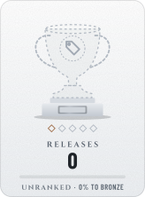</picture></a>
  <a href="https://github.com/tannergolden/trophies/blob/HEAD/docs/Catalogue.md#repository-merged"><picture><source media="(prefers-color-scheme: dark)" srcset="assets/trophies/merged.svg">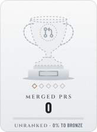</picture></a>
  <a href="https://github.com/tannergolden/trophies/blob/HEAD/docs/Catalogue.md#repository-resolved"><picture><source media="(prefers-color-scheme: dark)" srcset="assets/trophies/resolved.svg">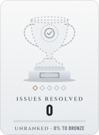</picture></a>
  <a href="https://github.com/tannergolden/trophies/blob/HEAD/docs/Catalogue.md#repository-active"><picture><source media="(prefers-color-scheme: dark)" srcset="assets/trophies/active.svg">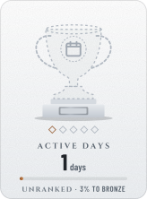</picture></a>
</p>

<details>
<summary><b>Achievements</b> · 23 of 100 earned · next: Green Machine I, 55%</summary>

<p align="center"><b>Launch</b></p>
<p align="center">
  <a href="https://github.com/tannergolden/trophies/blob/HEAD/docs/Catalogue.md#repository-stranger-report"><picture><source media="(prefers-color-scheme: dark)" srcset="assets/trophies/achievements/stranger-report.svg">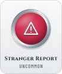</picture></a>
  <a href="https://github.com/tannergolden/trophies/blob/HEAD/docs/Catalogue.md#repository-named"><picture><source media="(prefers-color-scheme: dark)" srcset="assets/trophies/achievements/named.svg">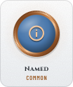</picture></a>
  <a href="https://github.com/tannergolden/trophies/blob/HEAD/docs/Catalogue.md#repository-filed"><picture><source media="(prefers-color-scheme: dark)" srcset="assets/trophies/achievements/filed.svg">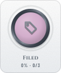</picture></a>
  <a href="https://github.com/tannergolden/trophies/blob/HEAD/docs/Catalogue.md#repository-first-fork"><picture><source media="(prefers-color-scheme: dark)" srcset="assets/trophies/achievements/first-fork.svg"></picture></a>
  <a href="https://github.com/tannergolden/trophies/blob/HEAD/docs/Catalogue.md#repository-first-merge"><picture><source media="(prefers-color-scheme: dark)" srcset="assets/trophies/achievements/first-merge.svg">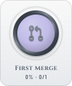</picture></a>
  <a href="https://github.com/tannergolden/trophies/blob/HEAD/docs/Catalogue.md#repository-first-release"><picture><source media="(prefers-color-scheme: dark)" srcset="assets/trophies/achievements/first-release.svg"></picture></a>
  <a href="https://github.com/tannergolden/trophies/blob/HEAD/docs/Catalogue.md#repository-first-star"><picture><source media="(prefers-color-scheme: dark)" srcset="assets/trophies/achievements/first-star.svg"></picture></a>
  <a href="https://github.com/tannergolden/trophies/blob/HEAD/docs/Catalogue.md#repository-first-tag"><picture><source media="(prefers-color-scheme: dark)" srcset="assets/trophies/achievements/first-tag.svg"></picture></a>
  <a href="https://github.com/tannergolden/trophies/blob/HEAD/docs/Catalogue.md#repository-first-watcher"><picture><source media="(prefers-color-scheme: dark)" srcset="assets/trophies/achievements/first-watcher.svg"></picture></a>
  <a href="https://github.com/tannergolden/trophies/blob/HEAD/docs/Catalogue.md#repository-front-door"><picture><source media="(prefers-color-scheme: dark)" srcset="assets/trophies/achievements/front-door.svg"></picture></a>
  <a href="https://github.com/tannergolden/trophies/blob/HEAD/docs/Catalogue.md#repository-outside-help"><picture><source media="(prefers-color-scheme: dark)" srcset="assets/trophies/achievements/outside-help.svg"></picture></a>
  <a href="https://github.com/tannergolden/trophies/blob/HEAD/docs/Catalogue.md#repository-poster"><picture><source media="(prefers-color-scheme: dark)" srcset="assets/trophies/achievements/poster.svg"></picture></a>
</p>

<p align="center"><b>Health</b></p>
<p align="center">
  <a href="https://github.com/tannergolden/trophies/blob/HEAD/docs/Catalogue.md#repository-clean-bill"><picture><source media="(prefers-color-scheme: dark)" srcset="assets/trophies/achievements/clean-bill.svg"></picture></a>
  <a href="https://github.com/tannergolden/trophies/blob/HEAD/docs/Catalogue.md#repository-auto-pilot"><picture><source media="(prefers-color-scheme: dark)" srcset="assets/trophies/achievements/auto-pilot.svg"></picture></a>
  <a href="https://github.com/tannergolden/trophies/blob/HEAD/docs/Catalogue.md#repository-form-filler"><picture><source media="(prefers-color-scheme: dark)" srcset="assets/trophies/achievements/form-filler.svg"></picture></a>
  <a href="https://github.com/tannergolden/trophies/blob/HEAD/docs/Catalogue.md#repository-gatekeeper"><picture><source media="(prefers-color-scheme: dark)" srcset="assets/trophies/achievements/gatekeeper.svg"></picture></a>
  <a href="https://github.com/tannergolden/trophies/blob/HEAD/docs/Catalogue.md#repository-house-rules"><picture><source media="(prefers-color-scheme: dark)" srcset="assets/trophies/achievements/house-rules.svg"></picture></a>
  <a href="https://github.com/tannergolden/trophies/blob/HEAD/docs/Catalogue.md#repository-locksmith"><picture><source media="(prefers-color-scheme: dark)" srcset="assets/trophies/achievements/locksmith.svg"></picture></a>
  <a href="https://github.com/tannergolden/trophies/blob/HEAD/docs/Catalogue.md#repository-paperwork"><picture><source media="(prefers-color-scheme: dark)" srcset="assets/trophies/achievements/paperwork.svg"></picture></a>
  <a href="https://github.com/tannergolden/trophies/blob/HEAD/docs/Catalogue.md#repository-support-line"><picture><source media="(prefers-color-scheme: dark)" srcset="assets/trophies/achievements/support-line.svg"></picture></a>
  <a href="https://github.com/tannergolden/trophies/blob/HEAD/docs/Catalogue.md#repository-town-hall"><picture><source media="(prefers-color-scheme: dark)" srcset="assets/trophies/achievements/town-hall.svg"></picture></a>
  <a href="https://github.com/tannergolden/trophies/blob/HEAD/docs/Catalogue.md#repository-welcome-mat"><picture><source media="(prefers-color-scheme: dark)" srcset="assets/trophies/achievements/welcome-mat.svg"></picture></a>
  <a href="https://github.com/tannergolden/trophies/blob/HEAD/docs/Catalogue.md#repository-documented"><picture><source media="(prefers-color-scheme: dark)" srcset="assets/trophies/achievements/documented.svg"></picture></a>
  <a href="https://github.com/tannergolden/trophies/blob/HEAD/docs/Catalogue.md#repository-licensed"><picture><source media="(prefers-color-scheme: dark)" srcset="assets/trophies/achievements/licensed.svg"></picture></a>
  <a href="https://github.com/tannergolden/trophies/blob/HEAD/docs/Catalogue.md#repository-well-formed"><picture><source media="(prefers-color-scheme: dark)" srcset="assets/trophies/achievements/well-formed.svg">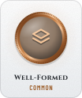</picture></a>
  <a href="https://github.com/tannergolden/trophies/blob/HEAD/docs/Catalogue.md#repository-label-maker"><picture><source media="(prefers-color-scheme: dark)" srcset="assets/trophies/achievements/label-maker.svg">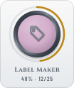</picture></a>
  <a href="https://github.com/tannergolden/trophies/blob/HEAD/docs/Catalogue.md#repository-changelog"><picture><source media="(prefers-color-scheme: dark)" srcset="assets/trophies/achievements/changelog.svg"></picture></a>
  <a href="https://github.com/tannergolden/trophies/blob/HEAD/docs/Catalogue.md#repository-open-hand"><picture><source media="(prefers-color-scheme: dark)" srcset="assets/trophies/achievements/open-hand.svg">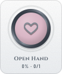</picture></a>
  <a href="https://github.com/tannergolden/trophies/blob/HEAD/docs/Catalogue.md#repository-protected"><picture><source media="(prefers-color-scheme: dark)" srcset="assets/trophies/achievements/protected.svg"></picture></a>
  <a href="https://github.com/tannergolden/trophies/blob/HEAD/docs/Catalogue.md#repository-roadmap"><picture><source media="(prefers-color-scheme: dark)" srcset="assets/trophies/achievements/roadmap.svg"></picture></a>
</p>

<p align="center"><b>Craft</b></p>
<p align="center">
  <a href="https://github.com/tannergolden/trophies/blob/HEAD/docs/Catalogue.md#repository-follows-the-standards"><picture><source media="(prefers-color-scheme: dark)" srcset="assets/trophies/achievements/follows-the-standards.svg"></picture></a>
  <a href="https://github.com/tannergolden/trophies/blob/HEAD/docs/Catalogue.md#repository-golden-path"><picture><source media="(prefers-color-scheme: dark)" srcset="assets/trophies/achievements/golden-path.svg"></picture></a>
  <a href="https://github.com/tannergolden/trophies/blob/HEAD/docs/Catalogue.md#repository-squeaky"><picture><source media="(prefers-color-scheme: dark)" srcset="assets/trophies/achievements/squeaky.svg"></picture></a>
  <a href="https://github.com/tannergolden/trophies/blob/HEAD/docs/Catalogue.md#repository-ready-room"><picture><source media="(prefers-color-scheme: dark)" srcset="assets/trophies/achievements/ready-room.svg"></picture></a>
  <a href="https://github.com/tannergolden/trophies/blob/HEAD/docs/Catalogue.md#repository-test-suite"><picture><source media="(prefers-color-scheme: dark)" srcset="assets/trophies/achievements/test-suite.svg"></picture></a>
  <a href="https://github.com/tannergolden/trophies/blob/HEAD/docs/Catalogue.md#repository-wired"><picture><source media="(prefers-color-scheme: dark)" srcset="assets/trophies/achievements/wired.svg"></picture></a>
  <a href="https://github.com/tannergolden/trophies/blob/HEAD/docs/Catalogue.md#repository-green-machine"><picture><source media="(prefers-color-scheme: dark)" srcset="assets/trophies/achievements/green-machine.svg">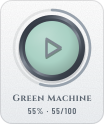</picture></a>
  <a href="https://github.com/tannergolden/trophies/blob/HEAD/docs/Catalogue.md#repository-by-the-book"><picture><source media="(prefers-color-scheme: dark)" srcset="assets/trophies/achievements/by-the-book.svg"></picture></a>
  <a href="https://github.com/tannergolden/trophies/blob/HEAD/docs/Catalogue.md#repository-signed"><picture><source media="(prefers-color-scheme: dark)" srcset="assets/trophies/achievements/signed.svg"></picture></a>
  <a href="https://github.com/tannergolden/trophies/blob/HEAD/docs/Catalogue.md#repository-containerized"><picture><source media="(prefers-color-scheme: dark)" srcset="assets/trophies/achievements/containerized.svg">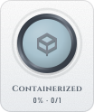</picture></a>
  <a href="https://github.com/tannergolden/trophies/blob/HEAD/docs/Catalogue.md#repository-gitmoji"><picture><source media="(prefers-color-scheme: dark)" srcset="assets/trophies/achievements/gitmoji.svg">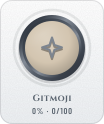</picture></a>
  <a href="https://github.com/tannergolden/trophies/blob/HEAD/docs/Catalogue.md#repository-packager"><picture><source media="(prefers-color-scheme: dark)" srcset="assets/trophies/achievements/packager.svg"></picture></a>
  <a href="https://github.com/tannergolden/trophies/blob/HEAD/docs/Catalogue.md#repository-prerelease"><picture><source media="(prefers-color-scheme: dark)" srcset="assets/trophies/achievements/prerelease.svg"></picture></a>
  <a href="https://github.com/tannergolden/trophies/blob/HEAD/docs/Catalogue.md#repository-release-notes"><picture><source media="(prefers-color-scheme: dark)" srcset="assets/trophies/achievements/release-notes.svg"></picture></a>
  <a href="https://github.com/tannergolden/trophies/blob/HEAD/docs/Catalogue.md#repository-semver"><picture><source media="(prefers-color-scheme: dark)" srcset="assets/trophies/achievements/semver.svg">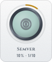</picture></a>
  <a href="https://github.com/tannergolden/trophies/blob/HEAD/docs/Catalogue.md#repository-small-steps"><picture><source media="(prefers-color-scheme: dark)" srcset="assets/trophies/achievements/small-steps.svg">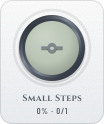</picture></a>
</p>

<p align="center"><b>Community</b></p>
<p align="center">
  <a href="https://github.com/tannergolden/trophies/blob/HEAD/docs/Catalogue.md#repository-triage"><picture><source media="(prefers-color-scheme: dark)" srcset="assets/trophies/achievements/triage.svg"></picture></a>
  <a href="https://github.com/tannergolden/trophies/blob/HEAD/docs/Catalogue.md#repository-crew"><picture><source media="(prefers-color-scheme: dark)" srcset="assets/trophies/achievements/crew.svg">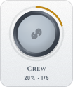</picture></a>
  <a href="https://github.com/tannergolden/trophies/blob/HEAD/docs/Catalogue.md#repository-regulars"><picture><source media="(prefers-color-scheme: dark)" srcset="assets/trophies/achievements/regulars.svg"></picture></a>
  <a href="https://github.com/tannergolden/trophies/blob/HEAD/docs/Catalogue.md#repository-ten-strong"><picture><source media="(prefers-color-scheme: dark)" srcset="assets/trophies/achievements/ten-strong.svg">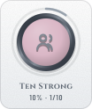</picture></a>
  <a href="https://github.com/tannergolden/trophies/blob/HEAD/docs/Catalogue.md#repository-long-thread"><picture><source media="(prefers-color-scheme: dark)" srcset="assets/trophies/achievements/long-thread.svg"></picture></a>
  <a href="https://github.com/tannergolden/trophies/blob/HEAD/docs/Catalogue.md#repository-talkative"><picture><source media="(prefers-color-scheme: dark)" srcset="assets/trophies/achievements/talkative.svg">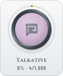</picture></a>
  <a href="https://github.com/tannergolden/trophies/blob/HEAD/docs/Catalogue.md#repository-answered"><picture><source media="(prefers-color-scheme: dark)" srcset="assets/trophies/achievements/answered.svg"></picture></a>
  <a href="https://github.com/tannergolden/trophies/blob/HEAD/docs/Catalogue.md#repository-fast-reply"><picture><source media="(prefers-color-scheme: dark)" srcset="assets/trophies/achievements/fast-reply.svg"></picture></a>
  <a href="https://github.com/tannergolden/trophies/blob/HEAD/docs/Catalogue.md#repository-good-first-issues"><picture><source media="(prefers-color-scheme: dark)" srcset="assets/trophies/achievements/good-first-issues.svg">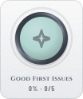</picture></a>
  <a href="https://github.com/tannergolden/trophies/blob/HEAD/docs/Catalogue.md#repository-help-wanted"><picture><source media="(prefers-color-scheme: dark)" srcset="assets/trophies/achievements/help-wanted.svg"></picture></a>
  <a href="https://github.com/tannergolden/trophies/blob/HEAD/docs/Catalogue.md#repository-mentor"><picture><source media="(prefers-color-scheme: dark)" srcset="assets/trophies/achievements/mentor.svg"></picture></a>
  <a href="https://github.com/tannergolden/trophies/blob/HEAD/docs/Catalogue.md#repository-org-backed"><picture><source media="(prefers-color-scheme: dark)" srcset="assets/trophies/achievements/org-backed.svg"></picture></a>
  <a href="https://github.com/tannergolden/trophies/blob/HEAD/docs/Catalogue.md#repository-outside-merges"><picture><source media="(prefers-color-scheme: dark)" srcset="assets/trophies/achievements/outside-merges.svg"></picture></a>
  <a href="https://github.com/tannergolden/trophies/blob/HEAD/docs/Catalogue.md#repository-popular-opinion"><picture><source media="(prefers-color-scheme: dark)" srcset="assets/trophies/achievements/popular-opinion.svg"></picture></a>
  <a href="https://github.com/tannergolden/trophies/blob/HEAD/docs/Catalogue.md#repository-reviewed"><picture><source media="(prefers-color-scheme: dark)" srcset="assets/trophies/achievements/reviewed.svg"></picture></a>
  <a href="https://github.com/tannergolden/trophies/blob/HEAD/docs/Catalogue.md#repository-well-maintained"><picture><source media="(prefers-color-scheme: dark)" srcset="assets/trophies/achievements/well-maintained.svg">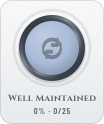</picture></a>
</p>

<p align="center"><b>Reach</b></p>
<p align="center">
  <a href="https://github.com/tannergolden/trophies/blob/HEAD/docs/Catalogue.md#repository-big-name"><picture><source media="(prefers-color-scheme: dark)" srcset="assets/trophies/achievements/big-name.svg"></picture></a>
  <a href="https://github.com/tannergolden/trophies/blob/HEAD/docs/Catalogue.md#repository-cloned"><picture><source media="(prefers-color-scheme: dark)" srcset="assets/trophies/achievements/cloned.svg">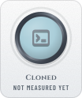</picture></a>
  <a href="https://github.com/tannergolden/trophies/blob/HEAD/docs/Catalogue.md#repository-downloaded"><picture><source media="(prefers-color-scheme: dark)" srcset="assets/trophies/achievements/downloaded.svg"></picture></a>
  <a href="https://github.com/tannergolden/trophies/blob/HEAD/docs/Catalogue.md#repository-fork-magnet"><picture><source media="(prefers-color-scheme: dark)" srcset="assets/trophies/achievements/fork-magnet.svg">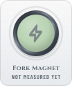</picture></a>
  <a href="https://github.com/tannergolden/trophies/blob/HEAD/docs/Catalogue.md#repository-forked-far"><picture><source media="(prefers-color-scheme: dark)" srcset="assets/trophies/achievements/forked-far.svg"></picture></a>
  <a href="https://github.com/tannergolden/trophies/blob/HEAD/docs/Catalogue.md#repository-living-forks"><picture><source media="(prefers-color-scheme: dark)" srcset="assets/trophies/achievements/living-forks.svg">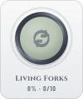</picture></a>
  <a href="https://github.com/tannergolden/trophies/blob/HEAD/docs/Catalogue.md#repository-referred"><picture><source media="(prefers-color-scheme: dark)" srcset="assets/trophies/achievements/referred.svg">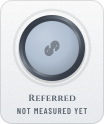</picture></a>
  <a href="https://github.com/tannergolden/trophies/blob/HEAD/docs/Catalogue.md#repository-registry"><picture><source media="(prefers-color-scheme: dark)" srcset="assets/trophies/achievements/registry.svg"></picture></a>
  <a href="https://github.com/tannergolden/trophies/blob/HEAD/docs/Catalogue.md#repository-star-of-the-week"><picture><source media="(prefers-color-scheme: dark)" srcset="assets/trophies/achievements/star-of-the-week.svg"></picture></a>
  <a href="https://github.com/tannergolden/trophies/blob/HEAD/docs/Catalogue.md#repository-stargazer-streak"><picture><source media="(prefers-color-scheme: dark)" srcset="assets/trophies/achievements/stargazer-streak.svg">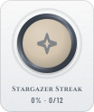</picture></a>
  <a href="https://github.com/tannergolden/trophies/blob/HEAD/docs/Catalogue.md#repository-trending"><picture><source media="(prefers-color-scheme: dark)" srcset="assets/trophies/achievements/trending.svg"></picture></a>
  <a href="https://github.com/tannergolden/trophies/blob/HEAD/docs/Catalogue.md#repository-used-by"><picture><source media="(prefers-color-scheme: dark)" srcset="assets/trophies/achievements/used-by.svg">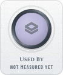</picture></a>
  <a href="https://github.com/tannergolden/trophies/blob/HEAD/docs/Catalogue.md#repository-visited"><picture><source media="(prefers-color-scheme: dark)" srcset="assets/trophies/achievements/visited.svg"></picture></a>
  <a href="https://github.com/tannergolden/trophies/blob/HEAD/docs/Catalogue.md#repository-watched"><picture><source media="(prefers-color-scheme: dark)" srcset="assets/trophies/achievements/watched.svg"></picture></a>
</p>

<p align="center"><b>Rhythm</b></p>
<p align="center">
  <a href="https://github.com/tannergolden/trophies/blob/HEAD/docs/Catalogue.md#repository-alive"><picture><source media="(prefers-color-scheme: dark)" srcset="assets/trophies/achievements/alive.svg">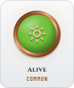</picture></a>
  <a href="https://github.com/tannergolden/trophies/blob/HEAD/docs/Catalogue.md#repository-long-game"><picture><source media="(prefers-color-scheme: dark)" srcset="assets/trophies/achievements/long-game.svg">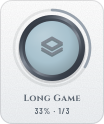</picture></a>
  <a href="https://github.com/tannergolden/trophies/blob/HEAD/docs/Catalogue.md#repository-same-day-fix"><picture><source media="(prefers-color-scheme: dark)" srcset="assets/trophies/achievements/same-day-fix.svg">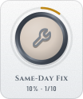</picture></a>
  <a href="https://github.com/tannergolden/trophies/blob/HEAD/docs/Catalogue.md#repository-streak"><picture><source media="(prefers-color-scheme: dark)" srcset="assets/trophies/achievements/streak.svg">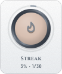</picture></a>
  <a href="https://github.com/tannergolden/trophies/blob/HEAD/docs/Catalogue.md#repository-marathon-day"><picture><source media="(prefers-color-scheme: dark)" srcset="assets/trophies/achievements/marathon-day.svg"></picture></a>
  <a href="https://github.com/tannergolden/trophies/blob/HEAD/docs/Catalogue.md#repository-night-shift"><picture><source media="(prefers-color-scheme: dark)" srcset="assets/trophies/achievements/night-shift.svg">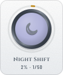</picture></a>
  <a href="https://github.com/tannergolden/trophies/blob/HEAD/docs/Catalogue.md#repository-weekly-beat"><picture><source media="(prefers-color-scheme: dark)" srcset="assets/trophies/achievements/weekly-beat.svg">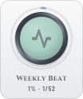</picture></a>
  <a href="https://github.com/tannergolden/trophies/blob/HEAD/docs/Catalogue.md#repository-big-week"><picture><source media="(prefers-color-scheme: dark)" srcset="assets/trophies/achievements/big-week.svg">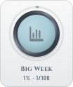</picture></a>
  <a href="https://github.com/tannergolden/trophies/blob/HEAD/docs/Catalogue.md#repository-comeback"><picture><source media="(prefers-color-scheme: dark)" srcset="assets/trophies/achievements/comeback.svg"></picture></a>
  <a href="https://github.com/tannergolden/trophies/blob/HEAD/docs/Catalogue.md#repository-friday-deploy"><picture><source media="(prefers-color-scheme: dark)" srcset="assets/trophies/achievements/friday-deploy.svg">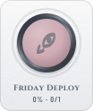</picture></a>
  <a href="https://github.com/tannergolden/trophies/blob/HEAD/docs/Catalogue.md#repository-monthly-release"><picture><source media="(prefers-color-scheme: dark)" srcset="assets/trophies/achievements/monthly-release.svg"></picture></a>
  <a href="https://github.com/tannergolden/trophies/blob/HEAD/docs/Catalogue.md#repository-weekend-project"><picture><source media="(prefers-color-scheme: dark)" srcset="assets/trophies/achievements/weekend-project.svg">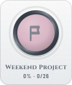</picture></a>
</p>

<p align="center"><b>Secret</b></p>
<p align="center">
  <a href="https://github.com/tannergolden/trophies/blob/HEAD/docs/Catalogue.md#repository-birthday"><picture><source media="(prefers-color-scheme: dark)" srcset="assets/trophies/achievements/birthday.svg"></picture></a>
  <a href="https://github.com/tannergolden/trophies/blob/HEAD/docs/Catalogue.md#repository-constellation"><picture><source media="(prefers-color-scheme: dark)" srcset="assets/trophies/achievements/constellation.svg"></picture></a>
  <a href="https://github.com/tannergolden/trophies/blob/HEAD/docs/Catalogue.md#repository-friday-the-13th"><picture><source media="(prefers-color-scheme: dark)" srcset="assets/trophies/achievements/friday-the-13th.svg"></picture></a>
  <a href="https://github.com/tannergolden/trophies/blob/HEAD/docs/Catalogue.md#repository-full-house"><picture><source media="(prefers-color-scheme: dark)" srcset="assets/trophies/achievements/full-house.svg"></picture></a>
  <a href="https://github.com/tannergolden/trophies/blob/HEAD/docs/Catalogue.md#repository-ghost"><picture><source media="(prefers-color-scheme: dark)" srcset="assets/trophies/achievements/ghost.svg"></picture></a>
  <a href="https://github.com/tannergolden/trophies/blob/HEAD/docs/Catalogue.md#repository-green-wall"><picture><source media="(prefers-color-scheme: dark)" srcset="assets/trophies/achievements/green-wall.svg"></picture></a>
  <a href="https://github.com/tannergolden/trophies/blob/HEAD/docs/Catalogue.md#repository-leap-day"><picture><source media="(prefers-color-scheme: dark)" srcset="assets/trophies/achievements/leap-day.svg"></picture></a>
  <a href="https://github.com/tannergolden/trophies/blob/HEAD/docs/Catalogue.md#repository-midnight-oil"><picture><source media="(prefers-color-scheme: dark)" srcset="assets/trophies/achievements/midnight-oil.svg"></picture></a>
  <a href="https://github.com/tannergolden/trophies/blob/HEAD/docs/Catalogue.md#repository-new-year"><picture><source media="(prefers-color-scheme: dark)" srcset="assets/trophies/achievements/new-year.svg"></picture></a>
  <a href="https://github.com/tannergolden/trophies/blob/HEAD/docs/Catalogue.md#repository-palindrome"><picture><source media="(prefers-color-scheme: dark)" srcset="assets/trophies/achievements/palindrome.svg"></picture></a>
  <a href="https://github.com/tannergolden/trophies/blob/HEAD/docs/Catalogue.md#repository-round-number"><picture><source media="(prefers-color-scheme: dark)" srcset="assets/trophies/achievements/round-number.svg"></picture></a>
  <a href="https://github.com/tannergolden/trophies/blob/HEAD/docs/Catalogue.md#repository-the-answer"><picture><source media="(prefers-color-scheme: dark)" srcset="assets/trophies/achievements/the-answer.svg"></picture></a>
</p>

</details>

<p align="center"><sub>Refreshed daily by <a href="https://github.com/tannergolden/trophies">tannergolden/trophies</a> · Every trophy and achievement, what it is for and how to earn it: <a href="https://github.com/tannergolden/trophies/blob/HEAD/docs/Catalogue.md#repository">the catalogue</a>. Click any card for its entry.</sub></p>
<!-- trophies:end -->

Two things to notice. Every card exists twice, a **Night** file for a dark
theme and a **Day** file for a light one, and the README shows one of them
through a `<picture>` element that follows the viewer's system theme, the
method GitHub documents. And the lettering is drawn as paths from two
open-licensed typefaces, Cinzel and Barlow Condensed, so a trophy looks the
same on every device.

Cards are 164 px wide so two fit across a phone; pins are 104 px so three do.
The level card and the next-up card sit side by side on a desktop and stack on
a phone.

### Five styles

`trophy` is the default: a cup on a plinth, with an enamel boss carrying the
trophy's icon and five pips counting the tiers. The others are `crest` (a
hexagonal shield whose ornaments change with the tier: rivets, a gem, wings, a
crown), `medallion` (a struck medal on a ribbon, with a progress ring),
`crystal` (glass that fills with light), and `plaque` (emblems' own flat look,
for a row of badges). One key in the config switches all of them.

---

## 🚀 Use It On Your Profile

Add this as `.github/workflows/trophies.yml` in your **profile repository**,
the one named after your account. That stub is the whole interface.

```yaml
name: Trophies
on:
  schedule:
    - cron: '0 0 * * *'
  workflow_dispatch:

permissions: {}

jobs:
  trophies:
    permissions:
      contents: write
      pull-requests: write
    uses: tannergolden/trophies/.github/workflows/trophies.yml@v1
    with:
      mode: profile
```

Run it once from the Actions tab. The first run writes a block between
`<!-- trophies:start -->` and `<!-- trophies:end -->` at the end of your README
(move the markers wherever you like; later runs rewrite only what is between
them), renders into `assets/trophies/`, and commits as `github-actions[bot]`.
Nothing is copied into your repository except that stub.

The bot commits, never you, because a commit authored by you would count
toward your own Commits and Streak trophies every day.

### Or a repository

The same stub with `mode: repository` gives any repository a case of its own,
measured from that repository: stars from other people, forks, contributors,
commits, releases, merged pull requests, issues resolved and active days, with
its own hundred achievements. `GITHUB_TOKEN` already reads everything about
its own repository, so private repositories need nothing extra.
[`examples/stub-repository.yml`](examples/stub-repository.yml) shows it with
`commit: pr`, which opens one evolving pull request instead of pushing.

### Options

Everything is optional. A [`.github/trophies.yml`](examples/trophies.yml)
in your repository can set:

| Key            | Default                | Meaning                                                                                        |
| :------------- | :--------------------- | :--------------------------------------------------------------------------------------------- |
| `mode`         | `profile`              | `profile` or `repository`.                                                                     |
| `style`        | `trophy`               | `trophy`, `crest`, `medallion`, `crystal` or `plaque`.                                         |
| `case`         | `both`                 | `night`, `day` or `both`.                                                                      |
| `theme`        | `picture`              | `picture` uses one `<picture>` per card (follows the system theme); `fragment` uses `#gh-*-mode-only` links, which GitHub no longer honours. |
| `banner`       | `true`                 | The level card and the next-up card.                                                           |
| `streak`       | `current`              | `current` or `longest`. The current streak changes daily while you are active.                 |
| `core`         | all eight              | Which trophies, in order.                                                                      |
| `enamel`       | `{}`                   | Recolor a trophy with any [emblems](https://github.com/tannergolden/emblems) color token.       |
| `achievements` | `all`                  | `all`, `none`, or a list of slugs.                                                             |
| `card`         | `[rank, weekly, new]`  | The Top % chip, the weekly change, the NEW ribbon.                                             |
| `ledger`       | `true`                 | Keep `.github/trophies.lock.json`.                                                             |
| `readme`       | `manage`               | Manage the block between the markers, or `none`.                                               |
| `private`      | `false`                | Count private contributions too. Needs a read-only personal token saved as `TROPHIES_TOKEN`.   |
| `scan_pages`   | `30`                   | Commits read per run for the heavy achievements, in pages of 100.                              |

The workflow also takes `mode`, `subject`, `style`, `commit` (`push` or `pr`)
and `commit-branch` as inputs, for the common cases without a config file.

---

## 🎯 What Gets Measured

Every trophy counts something that only grows. Tier thresholds rise about
five times per step, and past Diamond a trophy earns a **star** each time the
Diamond number doubles, up to five. Counting is honest by design: the profile
repository's own commits, bot commits, forks and stars you gave your own
repositories are all left out.

**[`docs/Catalogue.md`](docs/Catalogue.md)** lists every trophy and every
achievement in both modes, with its threshold and the exact GitHub data it is
read from. It is generated from the catalogue by `make catalogue` and checked
by `make check`, so it cannot drift from what the kit awards.

Achievements come in groups. Profile mode has **Milestones, Craft, Rhythm,
Community, Housekeeping and Secret**; repository mode has **Launch, Health,
Craft, Community, Reach, Rhythm and Secret**. Some are **tiered**: Polyglot is
earned at 5, 10 and 20 languages, and the pin shows the numeral you hold.
**Secret** ones show a question mark until earned. Ones marked **heavy** read
individual commits rather than a single count, so they run under a per-run
budget and catch up over about a week.

Four more exist only for the account that owns this repository and its
siblings. Everyone else's total is exactly one hundred.

---

## 🔁 How It Runs

Once a day, on the hour at midnight. Nothing on a trophy changes faster
than daily, and GitHub may delay a scheduled run when it is busy, which
costs nothing here.

**Every run recomputes everything from GitHub.** Nothing depends on the last
run, so a delayed or skipped one loses nothing. A run costs about fifteen
GraphQL queries plus the commit scanner's budget, a few percent of the hourly
limit for `GITHUB_TOKEN`.

**Every commit is a Conventional Commit, and no two read alike.** The bot
commits as `chore(trophies): 🏆 …` with a subject naming the most notable
thing that happened (a tier reached, an achievement earned, or which values
moved) and a body carrying the measured values, the date and the run, per the
[commit standard](https://github.com/tannergolden/standards/blob/Development/docs/distribution/Conventional-Commits.md).

**No date lives in an image.** A file only changes when its number does, so a
quiet day makes no commit. The **ledger**, `.github/trophies.lock.json`,
records the day each tier was first reached (for the NEW ribbon), a sparse
history of the core values (for the weekly change), and the scanner's cache.
It is written when a card changed, when a tier was reached, and once a week
regardless. That weekly commit is what keeps GitHub from switching the
schedule off after sixty quiet days.

---

## 🧭 Layout

```bash
trophies/
├── action.yml                      the composite action
├── .github/workflows/trophies.yml  the reusable workflow your stub calls
├── .github/workflows/case.yml      this repository's own case, by local path
├── .github/trophies.yml            this repository's own config
├── src/
│   ├── trophy-kit.py               the command line
│   ├── trophykit/                  catalogue, art, styles, measurement, ledger, README
│   └── fonts/                      glyph outlines and their OFL licences
├── assets/trophies/                this repository's committed case
├── examples/                       stubs and a starter config to copy
├── tests/                          the unit tests
└── docs/
    ├── Trophy-Kit.md               the full specification
    └── Catalogue.md                every trophy and achievement, generated
```

---

## 🛠️ Working On It

For developing the kit itself, in a clone. Consuming it needs none of this,
only the stub above.

```bash
make help                # list every target
make preview             # render the sample profile case into preview/ (no network)
make preview-repository  # the sample repository case
make catalogue           # regenerate docs/Catalogue.md from the data
make check               # CI gate: self-test, catalogue current, sample renders clean
make test                # the gate plus the unit tests
```

Rendering is deterministic and **prunes**: an SVG nothing names anymore is
deleted, so the output folder always mirrors the catalogue. Every SVG carries
a kit version stamp. `check` hard-fails only same-version drift and treats a
version difference as "regenerate next time", so a kit release can never
wedge a consumer's schedule. The self-test pins one canonical render to a
golden hash, so output cannot change unless someone bumps `KIT_VERSION`
knowingly.

To measure a real account locally:

```bash
GITHUB_TOKEN=... python3 src/trophy-kit.py measure --mode profile --subject octocat > m.json
python3 src/trophy-kit.py render --root /tmp/case --from m.json
```

Full specification: [`docs/Trophy-Kit.md`](docs/Trophy-Kit.md).

---

## 📄 License

MIT. See [`LICENSE`](LICENSE).

The glyph outlines in `src/fonts/glyphs.json` are from
[Cinzel](https://github.com/NDISCOVER/Cinzel) and
[Barlow](https://github.com/jpt/barlow), both under the SIL Open Font License
1.1, which permits embedding them in a document. [`NOTICE`](NOTICE) records
the attribution; the licences travel in `src/fonts/`.

---

## 🔗 See also

> [!TIP]
> [`tannergolden/emblems`](https://github.com/tannergolden/emblems) draws the
> badges; this draws the trophies, in the same palette. The engineering
> standards this repository follows are published in
> [`tannergolden/standards`](https://github.com/tannergolden/standards), and it
> was generated from [`tannergolden/path`](https://github.com/tannergolden/path),
> which is why it earns **Follows the Standards** and **Golden Path** itself.

---

<div align="center">

**Measured daily. Drawn once. Never fetched.**

[↑ Back to Top](#top)

<br />

Built with ❤️ by [@tannergolden](https://github.com/tannergolden). Distributed under the MIT License.

</div>
