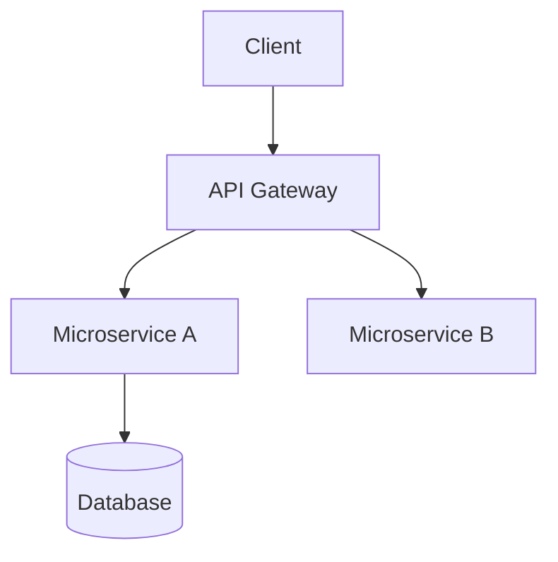

<!--
title: '📐 TECHNICAL DESIGN TEMPLATE'
description: 'Template for proposing and reviewing a technical design.'
tags: [template, design, architecture, engineering]
category: docs
-->

# 📐 TECHNICAL DESIGN TEMPLATE

**Proposes a system or major feature's architecture - components, data, interfaces, and the trade-offs behind them.**

_Strategic depth. Clear architecture. Long-term scale._

---

> [!IMPORTANT]
> **How to use**: copy this file to `docs/technical/designs/<short-slug>.md`, keep this template pristine, and update the design as decisions evolve. Record each significant pivot as an [ADR](ADR.md) and link it here.

---

## 📝 Abstract

A high-level summary of the system architecture and its purpose.

## 🎯 Goals & Non-Goals

- **Goals**: [What this design must achieve]
- **Non-Goals**: [What it deliberately does not attempt - prevents scope drift in review]

## 📐 Architecture

Detailed description of the system components and their interactions.

### Component Diagram

## 🔐 Data Model

Description of key entities and relationships.

## 📡 API Interface

- `GET /v1/resource`: Description
- `POST /v1/resource`: Description

## ⚖️ Alternatives Considered

| Alternative | Why not chosen                |
| :---------- | :---------------------------- |
| [Option B]  | [Trade-off that ruled it out] |
| [Option C]  | [Trade-off that ruled it out] |

## 🚀 Scalability & Performance

- Expected throughput
- Caching strategy
- Database optimization

## 🛡️ Security

- Authentication method
- Data encryption
- Role-based access control

## 📈 Observability

- Key metrics, logs, and traces this system must emit
- Alert thresholds and dashboards

## 🛫 Rollout & Migration

- Deployment strategy (flags, phases, canary)
- Data migration and backward compatibility
- Rollback plan

### 🔗 See also

> [!TIP]
> Every canonical guide is indexed in the [&#x1F4DA; Standards Index](https://github.com/tannergolden/standards/blob/Development/docs/README.md). If you rename or move a file, update every reference to it across the repository to prevent link drift.

---

**Architected with intent. Engineered for scale.**

[↑ Back to Top](#top)

 

Built with ❤️ by the Engineering Team. Distributed under the MIT License.

