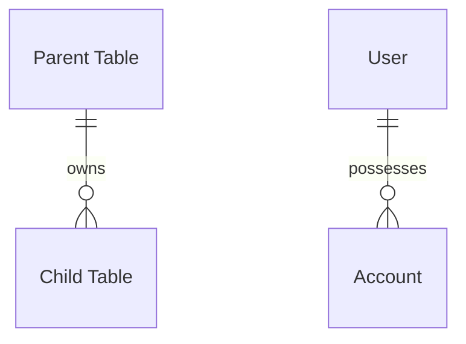

<!--
title: '📝 DATA MODELS & ENTITIES'
description: 'Standards for modeling entities and their relationships.'
tags: [database, modeling, entities, schema]
category: docs
-->

# 📝 DATA MODELS & ENTITIES

**Defining the relational blueprint and domain entities for type-safe persistence.**

_Domain-driven. Normalized layers. Optimized queries._

---

## 🎯 Our Modeling Philosophy

We treat the data schema as the rigid skeleton of our application. Our objective is to design models that accurately represent the business domain while maintaining high performance and structural integrity across the system.

- **Integrity**: Enforce relationships and constraints at the database level.
- **Optimization**: Design schemas around anticipated query patterns.
- **Traceability**: Every record includes consistent audit metadata.

---

## 💾 1. The Persistence Stack

Define the technologies used to store and retrieve state.

| Layer             | Technology                   | Role                        | Description                  |
| :---------------- | :--------------------------- | :-------------------------- | :--------------------------- |
| **Primary Store** | `[SQL \| NoSQL \| Graph]`    | Persistent source of truth. | Main data persistence layer. |
| **Caching**       | `[Redis \| Memcached]`       | High-speed transient state. | In-memory data acceleration. |
| **Search**        | `[Elasticsearch \| Algolia]` | Full-text retrieval.        | Specialized indexing engine. |
| **Blob Store**    | `[S3 \| GCS]`                | Unstructured media storage. | Cloud-based object storage.  |

---

## 🧬 2. Core Entity Definitions

Documenting the logical objects of the application.

### `[Entity Name Example]`

- **Intent**: `[Detailed business purpose]`
- **Identity Strategy**: `[UUID | Serial | Hash-based]`
- **Audit Requirement**: `[Standard: created_at, updated_at, deleted_at]`

---

## 🔗 3. Relational Topology

How entities interact and maintain integrity.

- **Cardinality**: `[1:1 | 1:N | M:N]`
- **Enforcement**: `[Foreign Key Constraints | Managed Embedding]`
- **Lifecycle**: `[CASCADE | SET NULL | RESTRICT]`

---

## ⚡ 4. Indexing & Optimization

Hardening the schema for performance.

- **Clustering**: `[Primary key organization strategy]`
- **Secondary Indexing**: `[Fields optimized for common filters]`
- **Specialized Indexes**: `[TSVECTOR Full-text | TTL cleanup]`

---

## 🗺️ 5. Architectural Topology

A visual representation of the ER (Entity-Relationship) diagram.

### 🔗 See also

> [!TIP]
> Every canonical guide is indexed in the [&#x1F4DA; Standards Index](https://github.com/tannergolden/standards/blob/Development/docs/README.md). If you rename or move a file, update every reference to it across the repository to prevent link drift.

---

**Strongly typed entities. Canonical data models.**

[↑ Back to Top](#top)

 

Built with ❤️ by the Engineering Team. Distributed under the MIT License.

